# DesiTV™ Server-Authoritative LIVE Broadcast Architecture

**Version:** 2.0  
**Date:** December 30, 2025  
**Status:** ✅ Implementation Complete

---

## Implementation Status (Updated December 2025)

| Component | File | Status |
|-----------|------|--------|
| **Server: Live State Service** | `server/services/liveStateService.js` | ✅ Complete |
| **Server: Live State Controller** | `server/controllers/liveStateController.js` | ✅ Complete |
| **Server: Live State Routes** | `server/routes/liveState.js` | ✅ Complete |
| **Server: serverTime in responses** | `server/routes/globalEpoch.js` | ✅ Complete |
| **Client: Player State Machine** | `client/src/logic/playback/PlayerStateMachine.js` | ✅ Complete |
| **Client: Live State Service** | `client/src/services/api/liveStateService.js` | ✅ Complete |
| **Client: Sync Thresholds** | `client/src/config/thresholds/sync.js` | ✅ Complete |
| **Client: useLiveSync Hook** | `client/src/hooks/useLiveSync.js` | ✅ Complete |
| **Client: LiveSyncWrapper** | `client/src/components/player/LiveSyncWrapper.jsx` | ✅ Complete |

---

## Executive Summary

This document defines the architecture for DesiTV™'s server-authoritative LIVE broadcast system. The design ensures:
- **Deterministic playback**: All users see the same content at the same time
- **Scalability**: Supports hundreds of concurrent users
- **Stateless server**: No per-user state stored server-side
- **Client resilience**: Graceful drift correction without disruption

---

## 1. Core Principles (Non-Negotiable)

| Principle | Description |
|-----------|-------------|
| **Server Authority** | Server is the single source of truth for LIVE playback |
| **Immutable Epoch** | GLOBAL_EPOCH created once at server start, persists until restart |
| **Stateless LIVE** | All LIVE state is derived, deterministic, and stateless |
| **Client Read-Only** | Clients cannot manipulate LIVE state |
| **Mode Transitions** | LIVE → MANUAL on channel change; MANUAL → LIVE on category change |

---

## 2. System Architecture

### 2.1 System Interaction Diagram


### 2.2 Player State Machine

```mermaid
stateDiagram-v2
    [*] --> OFF: App Load
    
    OFF --> LIVE: Power ON
    
    state LIVE {
        [*] --> Syncing
        Syncing --> Playing: Sync Complete
        Playing --> Syncing: Drift > Threshold
        Playing --> Correcting: Small Drift
        Correcting --> Playing: Correction Applied
    }
    
    LIVE --> MANUAL: Channel Change (↑/↓)
    
    state MANUAL {
        [*] --> ManualPlay
        ManualPlay --> ManualPlay: Channel Change
    }
    
    MANUAL --> LIVE: Category Change
    
    LIVE --> OFF: Power OFF
    MANUAL --> OFF: Power OFF
    
    note right of LIVE
        Server-authoritative
        Polling every 5s
        Auto drift correction
    end note
    
    note right of MANUAL
        User-controlled
        No server sync
        Persists until category change
    end note
```



### 2.3 Data Flow Sequence


---

## 3. GLOBAL_EPOCH Lifecycle

### 3.1 Definition

```
GLOBAL_EPOCH = The absolute reference point for all LIVE calculations
             = Created ONCE when server starts (if not exists)
             = NEVER modified during runtime
             = Stored in MongoDB with _id: 'global'
```

### 3.2 Lifecycle Diagram


### 3.3 Server Implementation

```javascript
// models/GlobalEpoch.js - Current implementation is CORRECT
// Key behaviors:
// 1. _id: 'global' ensures singleton
// 2. getOrCreate() is idempotent
// 3. epoch is Date type, indexed

// services/globalEpochService.js - ENHANCEMENTS NEEDED
// Add: Server timestamp in response for client drift calculation
// Add: Monotonic server clock validation
```

### 3.4 Client Rules

| Rule | Implementation |
|------|----------------|
| Fetch epoch on app start | `useAppInitialization` hook |
| Lock epoch after first fetch | `globalEpochLocked = true` |
| Never modify epoch locally | Read-only after initialization |
| Retry with backoff on failure | 3 retries, exponential backoff |
| Fallback epoch if all fails | `2020-01-01T00:00:00Z` (last resort) |

---

## 4. LIVE State API Design

### 4.1 New Endpoint: GET /api/live-state

**Purpose:** Single endpoint for all LIVE state calculations (replaces multiple endpoints)

**Request:**
```http
GET /api/live-state?categoryId=<id>&includeNext=true
Cache-Control: no-store
```

**Response:**
```json
{
  "live": {
    "categoryId": "cat_123",
    "categoryName": "Bollywood Hits",
    "videoIndex": 2,
    "videoId": "yt_abc123",
    "videoTitle": "Song Title",
    "position": 45.32,
    "duration": 240,
    "remaining": 194.68
  },
  "next": {
    "videoIndex": 3,
    "videoId": "yt_def456",
    "videoTitle": "Next Song"
  },
  "slot": {
    "current": "prime_time",
    "cyclePosition": 3645.32,
    "cycleCount": 127
  },
  "sync": {
    "epoch": "2020-01-01T00:00:00.000Z",
    "serverTime": "2025-12-30T10:15:45.320Z",
    "checksum": "abc123"
  }
}
```

### 4.2 Calculation Formula (Server-Side)

```javascript
function calculateLiveState(categoryId, epoch, serverTime) {
  const category = getCategory(categoryId);
  const videos = category.items;
  const durations = videos.map(v => v.duration || 300);
  const totalDuration = durations.reduce((a, b) => a + b, 0);
  
  // Elapsed since epoch (in seconds)
  const elapsed = (serverTime - epoch) / 1000;
  
  // Position within current cycle
  const cyclePosition = elapsed % totalDuration;
  const cycleCount = Math.floor(elapsed / totalDuration);
  
  // Find current video
  let accumulated = 0;
  let videoIndex = 0;
  let position = 0;
  
  for (let i = 0; i < videos.length; i++) {
    if (accumulated + durations[i] > cyclePosition) {
      videoIndex = i;
      position = cyclePosition - accumulated;
      break;
    }
    accumulated += durations[i];
  }
  
  return {
    videoIndex,
    position,
    duration: durations[videoIndex],
    remaining: durations[videoIndex] - position,
    cyclePosition,
    cycleCount
  };
}
```

### 4.3 Caching Strategy

| Layer | TTL | Key Pattern | Invalidation |
|-------|-----|-------------|--------------|
| L1 (Memory) | 100ms | `live:${categoryId}` | Auto-expire |
| L2 (Redis) | 500ms | `live:${categoryId}` | Auto-expire |
| Browser | No-store | - | - |

**Why short TTL?** LIVE state changes every frame. We cache briefly to handle burst requests but ensure freshness.

---

## 5. Player State Machine Implementation

### 5.1 States

```typescript
enum PlayerMode {
  OFF = 'off',           // TV is off
  LIVE = 'live',         // Server-authoritative playback
  MANUAL = 'manual',     // User-controlled playback
  SYNCING = 'syncing',   // Transitioning to LIVE
  CORRECTING = 'correcting' // Applying drift correction
}
```

### 5.2 Transitions

| From | To | Trigger | Action |
|------|-----|---------|--------|
| OFF | LIVE | Power ON | Fetch LIVE state, start polling |
| LIVE | MANUAL | Channel ↑/↓ | Stop polling, store position |
| MANUAL | LIVE | Category change | Fetch LIVE state, start polling |
| LIVE | SYNCING | Drift > 2s | Show buffer overlay, seek |
| SYNCING | LIVE | Seek complete | Hide overlay, resume polling |
| LIVE | CORRECTING | 0.5s < Drift < 2s | Adjust playbackRate |
| CORRECTING | LIVE | Drift < 0.5s | Reset playbackRate to 1.0 |

### 5.3 Implementation Location

```
client/src/logic/playback/PlayerStateMachine.js (NEW)
├── state: PlayerMode
├── currentCategoryId: string
├── isPolling: boolean
├── lastSyncTime: Date
├── transition(event): void
├── startPolling(): void
├── stopPolling(): void
└── handleDrift(serverPosition, localPosition): void
```

---

## 6. Drift Detection & Correction

### 6.1 Drift Calculation

```javascript
function calculateDrift(serverState, localState, networkLatency) {
  // Account for network round-trip time
  const serverPosition = serverState.position + (networkLatency / 2000);
  const localPosition = player.getCurrentTime();
  
  const drift = localPosition - serverPosition;
  
  return {
    drift,           // Positive = ahead, Negative = behind
    absDrift: Math.abs(drift),
    direction: drift > 0 ? 'ahead' : 'behind'
  };
}
```

### 6.2 Correction Strategy


### 6.3 Thresholds Configuration

```javascript
// config/thresholds/sync.js (NEW)
export const SYNC_THRESHOLDS = {
  // Polling
  POLL_INTERVAL_MS: 5000,           // Poll every 5 seconds
  POLL_TIMEOUT_MS: 3000,            // Request timeout
  
  // Drift correction
  DRIFT_IGNORE_MS: 500,             // Ignore drift < 0.5s
  DRIFT_RATE_ADJUST_MS: 2000,       // Rate adjust for 0.5s-2s drift
  DRIFT_SEEK_MS: 2000,              // Seek for drift >= 2s
  
  // Playback rate
  RATE_CATCHUP: 1.02,               // Speed up to catch up
  RATE_SLOWDOWN: 0.98,              // Slow down if ahead
  RATE_NORMAL: 1.0,                 // Normal playback
  
  // Buffer overlay
  BUFFER_SHOW_MS: 500,              // Min time to show buffer
  BUFFER_HIDE_DELAY_MS: 200,        // Delay before hiding
  
  // Network
  LATENCY_SAMPLE_COUNT: 5,          // RTT samples to average
  MAX_ACCEPTABLE_LATENCY_MS: 1000,  // Max network latency
};
```

---

## 7. Security Constraints

### 7.1 Server-Side

| Constraint | Implementation |
|------------|----------------|
| Epoch read-only for clients | No POST/PUT/DELETE on `/api/global-epoch` (except admin) |
| LIVE state is calculated, not stored | No database writes for LIVE state |
| No per-user state | LIVE calculation is purely deterministic |
| Rate limiting | Max 60 requests/minute per IP for LIVE state |

### 7.2 Client-Side

| Constraint | Implementation |
|------------|----------------|
| Cannot modify server epoch | `globalEpochLocked = true` after fetch |
| Cannot fake LIVE state | Always poll server, never calculate locally for LIVE |
| MANUAL mode is local only | Server doesn't know about MANUAL mode |
| Category change forces LIVE | `setManualMode(false)` on category change |

---

## 8. Failure Recovery

### 8.1 Network Failures

```mermaid
flowchart TD
    A[Poll Request] --> B{Response?}
    
    B -->|Success| C[Update LIVE State]
    B -->|Timeout| D[Retry with Backoff]
    B -->|Error| D
    
    D --> E{Retry Count}
    E -->|< 3| F[Wait 2^n seconds]
    F --> A
    E -->|>= 3| G[Continue with Last Known State]
    G --> H[Show "Reconnecting..." indicator]
    H --> I[Background Retry Loop]
    I -->|Success| J[Resume Normal Polling]
    I -->|Still Failing| I
    
    style G fill:#ffd700,stroke:#333
    style H fill:#ff6b6b,stroke:#333,color:#fff
```

### 8.2 Video Failures

| Scenario | Action |
|----------|--------|
| Video unavailable | Skip to next video in playlist |
| YouTube API error | Retry 3x with backoff, then skip |
| Seek fails | Reload video at target position |
| Player crash | Remount YouTube component |

---

## 9. Concurrency & Scaling

### 9.1 Request Volume Estimation

| Metric | Value |
|--------|-------|
| Concurrent users | 500 |
| Poll interval | 5 seconds |
| Requests/second | 100 |
| Peak multiplier | 2x |
| Peak requests/second | 200 |

### 9.2 Caching Impact

```
Without caching: 200 req/s × $0.0001/req = $1.73/day
With L1+L2 cache (90% hit): 20 req/s = $0.17/day
Savings: 90%
```

### 9.3 Horizontal Scaling


---

## 10. Implementation Checklist

### Phase 1: Server Enhancements (Priority: HIGH)

- [ ] Create `/api/live-state` endpoint
- [ ] Add `serverTime` to all responses
- [ ] Implement short-TTL caching for LIVE state
- [ ] Add rate limiting for LIVE endpoints

### Phase 2: Client State Machine (Priority: HIGH)

- [ ] Create `PlayerStateMachine.js`
- [ ] Refactor `useBroadcastPosition` hook
- [ ] Implement mode transitions
- [ ] Add state persistence for MANUAL mode

### Phase 3: Drift Correction (Priority: MEDIUM)

- [ ] Add drift calculation to sync service
- [ ] Implement playbackRate adjustment
- [ ] Implement smooth seek for large drift
- [ ] Add buffer overlay for transitions

### Phase 4: Testing & Validation (Priority: HIGH)

- [ ] Unit tests for LIVE state calculation
- [ ] Integration tests for state machine
- [ ] Load tests for 500 concurrent users
- [ ] Drift simulation tests

---

## 11. Current Implementation Analysis

### 11.1 What's Already Correct ✅

| Component | Status | Notes |
|-----------|--------|-------|
| `GlobalEpoch` model | ✅ Correct | Singleton pattern, immutable |
| `globalEpochService` | ✅ Correct | Caching, checksum validation |
| `BroadcastStateManager` | ✅ Mostly correct | Good epoch handling, manual mode |
| `useBroadcastPosition` | ✅ Correct | Single source of truth |
| `checksumSyncService` | ✅ Correct | Background validation |

### 11.2 What Needs Enhancement 🔧

| Component | Issue | Recommended Fix |
|-----------|-------|-----------------|
| Server LIVE API | Missing unified endpoint | Create `/api/live-state` |
| Server response | Missing `serverTime` | Add to all responses |
| Drift correction | Not implemented | Add playbackRate adjustment |
| Player state machine | Implicit in component | Extract to dedicated module |
| Polling interval | Fixed 5s | Make configurable per mode |

### 11.3 What Must NOT Change ⛔

| Component | Reason |
|-----------|--------|
| `GLOBAL_EPOCH` immutability | Core to sync guarantee |
| Category change → LIVE | Ensures sync recovery |
| Channel change → MANUAL | Preserves user control |
| Server statelessness | Enables scaling |

---

## Appendix A: Glossary

| Term | Definition |
|------|------------|
| **GLOBAL_EPOCH** | Immutable timestamp marking the start of all playlists |
| **LIVE mode** | Server-authoritative playback with periodic sync |
| **MANUAL mode** | User-controlled playback without server sync |
| **Drift** | Difference between server position and local position |
| **Cycle** | One complete playthrough of a playlist |
| **Slot** | Time-based segment (e.g., morning, prime_time) |

---

## Appendix B: API Reference

### GET /api/global-epoch
Returns the immutable global epoch.

### GET /api/live-state (NEW)
Returns current LIVE state for a category.

### GET /api/channels
Returns all channels/playlists with metadata.

---

*Document maintained by: Principal System Architect*  
*Last updated: December 30, 2025*
